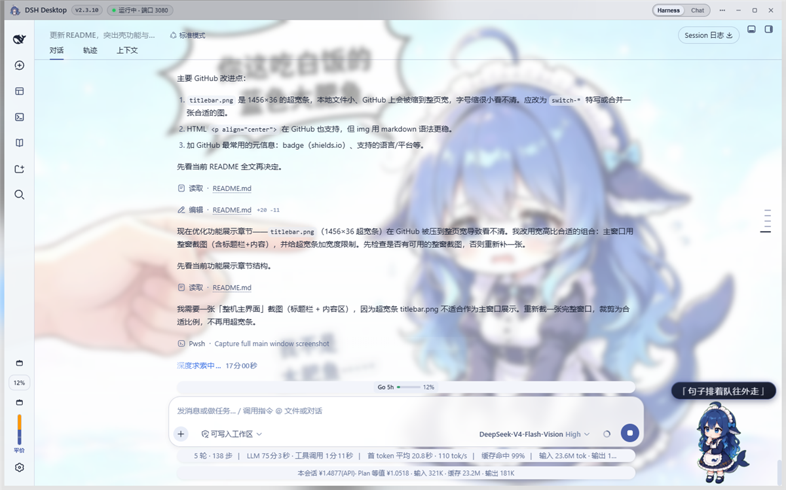
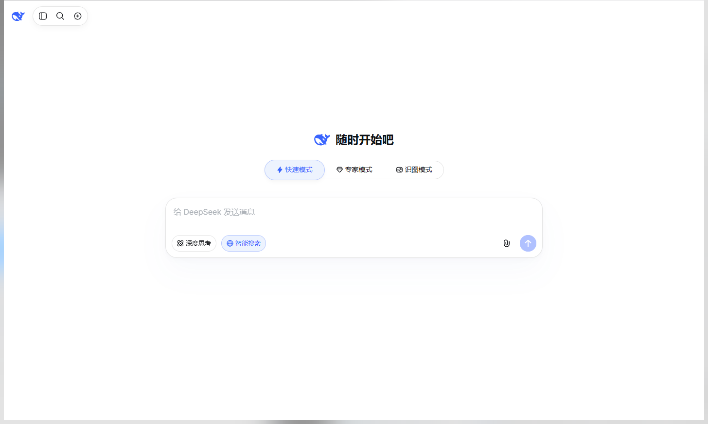
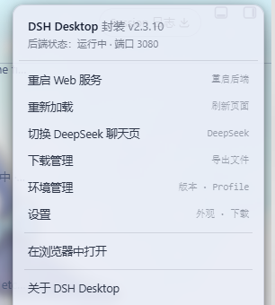
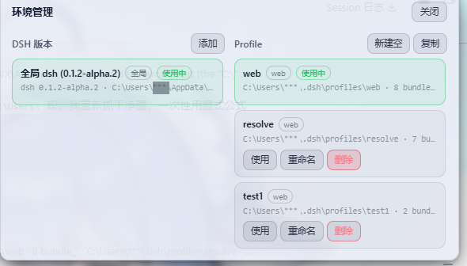
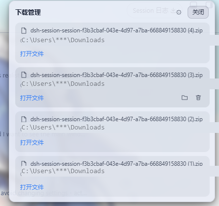
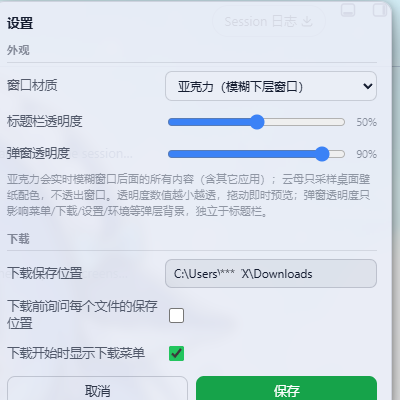
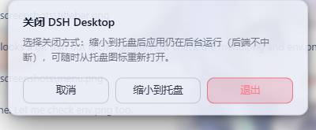

# 大肥鱼 Desktop （DSH Desktop）

<div align="center">


**DeepSeek Harness 的 Windows 桌面壳** —— 一个只负责包住「大肥鱼」的壳，不碰内容本身。

[](https://github.com/A8Chann/dsh_desktop)
[](https://tauri.app)
[](https://www.rust-lang.org)
[](LICENSE)

</div>

大肥鱼 Desktop 是把 `dsh web` 变成「双击即用」桌面应用的壳：

- **不重写、不改造、不夹带** —— 内容区跑的还是官方 `dsh web`，原汁原味；
- 壳只解决桌面体验问题：窗口、标题栏、托盘、启动、下载、环境切换……

以前用 DeepSeek Harness 要「打开终端 → 敲 `dsh web` → 浏览器开标签页」，
现在只需要双击一个 exe。

---

## 一、它只做壳的事

### 壳负责的

| 职责 | 说明 |
|---|---|
| **窗口** | 无边框窗口 + 自绘 36px 标题栏：拖拽 / 最小化 / 最大化 / 关闭 |
| **启动** | 自动查找本机 dsh 并拉起后端；没有就测速选最快的 npm 源自动安装 |
| **状态** | 标题栏实时徽标：`运行中 · 端口` / `启动中` / `异常 · 重试倒计时` |
| **环境管理** | 管理 dsh 版本 与 Profile：添加 / 更新 / 复制 / 重命名 / 删除 / 一键切换 |
| **下载管理** | 接管页面下载请求，内置下载器：进度 / 暂停 / 继续 / 取消 / 重试，完成通知 |
| **页面切换** | 同一窗口内 `Harness ⇄ DeepSeek 聊天` 一键切换 |
| **托盘** | 双击显示窗口；右键菜单：显示主窗口 / 重启后端 / 浏览器打开 / 日志目录 / 退出 |
| **退出** | 关闭时弹三选：取消 / 缩小到托盘 / 退出；**退出必杀自有后端进程树**，不留后台进程 |
| **外观** | 主题桥只读采样内容页渲染色 → 标题栏配色自动跟随；窗口材质可选亚克力 / 云母 / 纯色 |
| **守护** | 单实例保护、旧实例智能接管、后端崩溃自动退避重试（1s → 30s 封顶） |

### 壳不碰的

- **内容页原样运行**：`dsh web` 占独立 WebView，壳不改它的 DOM、样式、行为；
  登录、会话、插件、任务板、皮肤……全是 dsh 自己的事；
- **不注入业务逻辑**：壳对内容页仅有两次轻量注入——只读主题采样桥（取渲染色，不改任何东西）
  和点击转发（用于收起外壳弹层）；切换环境时的全屏加载遮罩也是壳自己画的临时层，结束后即移除，
  同样不触碰 `dsh web` 的任何页面内容；
- **升级回退归 dsh**：用哪个版本、哪个 Profile 由你决定，壳只负责「启动哪一个」；
- **壳与内容分离**：标题栏和弹层画在独立的透明外壳层（WebView）上，互不污染。

一句话：**壳是壳，内容是内容。**

---

## 二、亮点功能

1. **双击即用**
   首启自动测速选源安装 dsh → 自动 `dsh web` → 自动跳转页面，全程不用碰命令行。

2. **自绘标题栏，真毛玻璃**
   亚克力（实时模糊窗口后的一切）或云母（采样壁纸底纹）可随时切换；
   标题栏颜色由内容页真实渲染色驱动，切皮肤、切明暗都会自动跟随。

3. **内置环境管理**
   多套 dsh 版本、多套 Profile 并存，一键切换、即切即用；
   支持复制 Profile 现场（含 node_modules）修复出错环境，使用中的环境防误删。

4. **自管下载器**
   WebView2 原生下载在 Tauri 下不可靠，壳用稳定下载器接管：
   进度条、暂停 / 继续、取消 / 重试、保存位置询问、完成 toast 通知。

5. **同一窗口两页**
   `Harness`（dsh 主界面）⇄ `Chat`（DeepSeek 聊天页）一键切换，
   两页各有独立 WebView，切页不丢状态、主题互不串。

6. **关闭 ≠ 退出**
   点 ✕ / Alt+F4 弹「退出 / 缩小到托盘」：缩到托盘后端继续跑，随时双击托盘图标回来。

7. **省心守护**
   后端意外退出自动重启；重复启动自动聚焦已有实例；退出时清理后端进程树，不留孤立node进程。

---

## 三、功能展示（实拍）

**主窗口：自绘标题栏 + 状态徽标 + 页面切换开关，内容区是完整的 dsh 界面**



**一键切换 Harness ⇄ Chat：同一个窗口，点一下标题栏开关就换页**

滑柄显示当前页名，另一侧底色显示目标页名：

| Harness（dsh 主界面） | Chat（DeepSeek 聊天页） |
|---|---|
|  |  |

切到 Chat 页后，内容区就是干净的 DeepSeek 聊天页：



**⋯ 菜单：重启后端 / 重新加载 / 切页 / 下载管理 / 环境管理 / 设置 / 浏览器打开 / 退出**



**环境管理：dsh 版本 × Profile 双列管理，一键切换**



**下载管理：进度 / 暂停 / 打开文件，一目了然**



**设置：窗口材质、标题栏/弹窗透明度、下载位置**



**关闭弹窗：取消 / 缩小到托盘 / 退出**



---

## 四、快速开始

1. 从 **[GitHub Releases](https://github.com/A8Chann/dsh_desktop/releases)** 下载最新的 `DSH-Desktop-<版本>-tauri.exe`（单文件，双击即用）；
2. 双击运行——首次启动会自动找到本机 dsh 并拉起后端（没有就自动安装）；
3. 之后每次双击即开，后端由壳自动维护。

常用操作：

| 想做什么 | 怎么做 |
|---|---|
| 切换 dsh 版本 / Profile | ⋯ 菜单 → 环境管理 → 选目标点「使用」（自动重启后端并刷新） |
| 重启后端 | ⋯ 菜单 → 重启 Web 服务 / 托盘右键 |
| 刷新页面 | ⋯ 菜单 → 重新加载 |
| 切到 DeepSeek 聊天页 | 标题栏 `Harness ⇄ Chat` 开关 |
| 关到后台继续跑 | 标题栏 ✕ → 缩小到托盘 |

---

## 五、构建（开发者）

环境要求：

- Windows 10/11 x64，[WebView2 运行时](https://developer.microsoft.com/microsoft-edge/webview2/)（系统自带或自动安装）
- Rust stable + MSVC（VS Build Tools C++ 工作负载）、Node.js

```bash
# 1) 图标（可选，仓库已带 assets/icon.png、src-tauri/icons/）
npm run icon      # 重新生成 assets/icon.png
npm run icon:ico  # 从 icon.png 生成全尺寸 assets/icon.ico

# 2) Tauri 构建
cd src-tauri
cargo tauri build --no-bundle        # 产物：src-tauri/target/release/dsh-desktop.exe
```

发布产物：`dist/DSH-Desktop-<版本>-tauri.exe`（单文件，双击即用）。

> 注：`npm run icon:ico` 生成的 `src-tauri/icons/icon.ico` 需手动同步
> （复制 `assets/icon.ico` → `src-tauri/icons/icon.ico`）。

### 目录结构

```
src-tauri/                 Tauri（Rust）桌面壳
  src/
    main.rs                入口：窗口/托盘/菜单/后端导航与状态推送
    backend.rs             dsh 后端管理：拉起/接管外部实例/退避自愈/状态发布
    environments.rs        环境管理：dsh 版本独立目录安装/CRUD/切换 + profile 扫描/新建/复制
    controls.rs            自绘标题栏注入脚本 + 本地 HTTP 控制服务 + 插件变更监控 + 控制通道 + 自动汇报
    downloads.rs           自管下载器（进度/暂停/继续/取消）
    settings.rs            设置读写（%APPDATA%\DSH Desktop\settings.json，与旧版兼容）
    util.rs                日志/netstat 端口探测/HTTP 探测
  frontend/                loading.html（启动页）+ chrome.html（标题栏/弹层/环境管理面板）
  icons/                   应用图标集
scripts/                   图标生成（纯 Node，零依赖）
assets/                    icon.png / icon.ico 源图标
docs/screenshots/          README 实拍图
```

---

## 六、排障

- 日志：`%APPDATA%\DSH Desktop\logs\main.log`（含前端打点 `[web]`、HTTP 控制 `[http]`、下载 `[download]` 等，可直接定位问题）
- 本地 HTTP 控制端口 `127.0.0.1:19431` 被占用：杀掉占用进程后重启应用
- 任务栏图标显示旧缓存：重启 Windows 资源管理器

---

## 许可

[MIT License](LICENSE) (c) 2026 A8Chann
